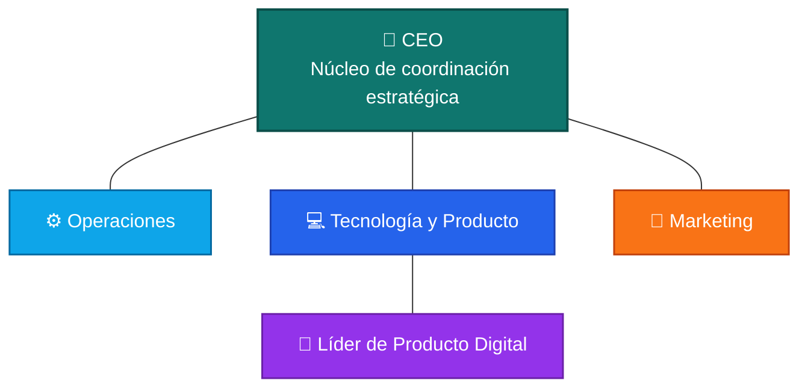

# BUSQUA 🚀

En BUSQUA hacemos simple algo que normalmente toma mucho tiempo: **buscar, comparar y comprar**.

Somos una plataforma tecnológica nacida en Ecuador que usa analítica de datos e Inteligencia Artificial para reunir en un solo lugar información verificada de productos, precios y disponibilidad real en distintas tiendas.

Nuestro objetivo es ayudarte a decidir mejor, más rápido y con confianza. ✅

## 🌱 ¿Cómo nació BUSQUA?

BUSQUA nació en **febrero de 2026 en Quito, Ecuador**, impulsada por un equipo de ingenieros y amigos de la EPN que detectaron un problema cotidiano: perder tiempo buscando un producto entre muchas tiendas, con precios distintos y poca claridad.

A partir de esa frustración, construimos una solución para transformar el caos del mercado en información útil y decisiones de compra inteligentes. 💡

## 🔎 ¿Qué hace BUSQUA?

- Centraliza información de múltiples tiendas.
- Compara precios y disponibilidad real.
- Facilita decisiones de compra rápidas y seguras.
- Ofrece una experiencia clara, confiable y orientada al usuario.

## 🤝 Estructura Organizacional (Funcional y Horizontal)

En BUSQUA trabajamos con un modelo **no jerárquico rígido**: el **CEO** funciona como núcleo de coordinación estratégica, y las demás áreas operan de forma funcional y colaborativa.

